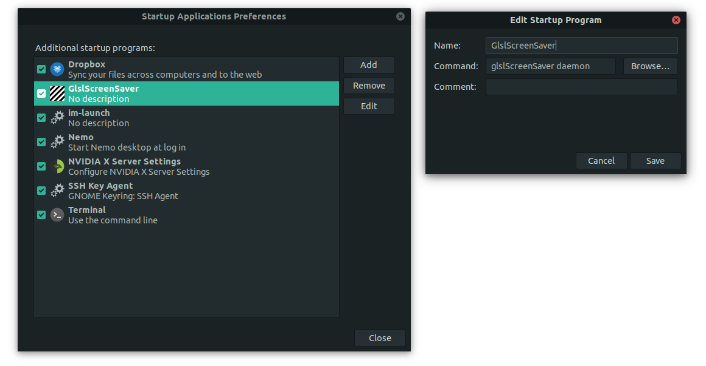
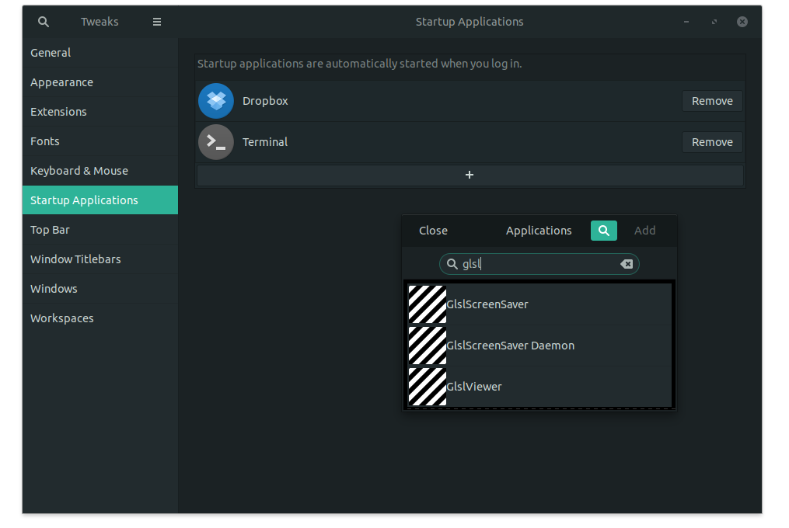

Make your own ScreenSaver using GlslViewer

## Install

1. Install [GlslViewer](https://github.com/patriciogonzalezvivo/glslViewer/wiki/Installing)
```bash
sudo add-apt-repository ppa:patriciogv/glslviewer-ppa
sudo apt-get update
sudo apt install glslviewer
```

2. Install `Xprintidle`:
```bash 
sudo apt install xprintidle
```

3. Clone this repo in your user folder. It will be clone in `.glslScreenSaver` so you will not see it
```bash 
cd ~
git clone https://github.com/patriciogonzalezvivo/.glslScreenSaver.git
```

4. Link the `config.yaml` to your user folder as `.glslScreenSaver.yaml`. That's the file glslScreenSaver will use as configuration file.

```bash
cd ~
ln -s .glslScreenSaver/config.yaml .glslScreenSaver.yaml
```

5. Add GlslScreenSaver to run at the begining of your session. Here you have two options:

Run `gnome-session-properties`, Click on `Add` and then fill the following data

```
Name:    GlslScreenSaver
Command: glslScreenSaver daemon
```

Should look like this



Or run `gnome-tweaks`, Click on `Startup Applications` then the `+` button and search for `glslScreenSaver`. 




## Set it up

Edit the `~/.glslScreenSaver.yaml` to choose how much time and what shader (o list of shaders) should run

```bash
nano ~/.glslScreenSaver.yaml
```

## Make your own screensaver

1. Duplicate any of the default shaders under `~/.glslScreenSaver/`
2. Edit it with your favorite code editor and then add it to `~/.glslScreenSaver.yaml`
3. Try it out:

```bash
glslScreenSaver
```

Note: If you are new to glsl shader you probably want to take a look to https://thebookofshaders.com/ to learn how to code them