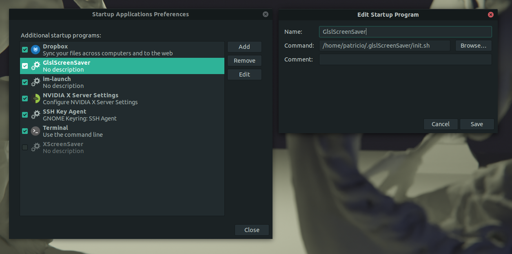

Make your own ScreenSaver using GlslViewer

## Install

1. Install [GlslViewer](https://github.com/patriciogonzalezvivo/glslViewer/wiki/Compiling-GlslViewer)

2. Install XScreenSaver and Xprintidle:
```bash 
sudo apt install xscreensaver xprintidle
```

3. Clone this repo in your user folder. It will be clone in `.glslScreenSaver` so you will not see it
```bash 
cd 
git clone https://github.com/patriciogonzalezvivo/.glslScreensaver.git
```

4. Run `gnome-session-properties`, Click on `Add` and then fill the following data

```
Name:    GlslScreenSaver
Command: /home/[your_user]/.glslScreenSaver/init.sh
```

Should look like this



## Change the shaders

* See what options you have `./setup.sh` and choose the one by typing the id number

```bash
cd ~/.glslScreenSaver
./setup.sh
```

* Test it using `./run.sh`

```bash
cd ~/.glslScreenSaver
./run.sh
```

## Make your own screensaver

1. Duplicate any of the default shaders under `~/.glslScreenSaver/shaders/`
2. Edit it with your favorite code editor
3. try it out with glslViewer

Note: If you are new to glsl shader you probably want to take a look to https://thebookofshaders.com/ to learn how to code them